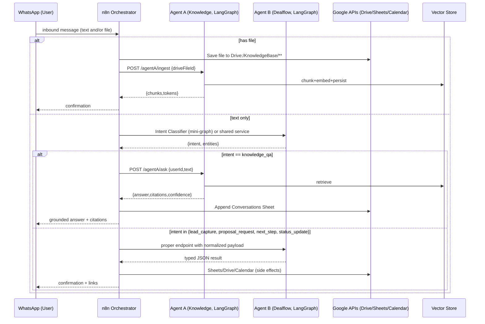
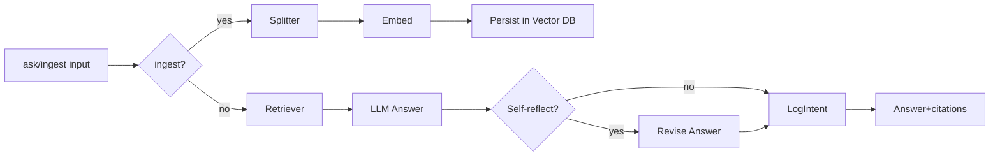
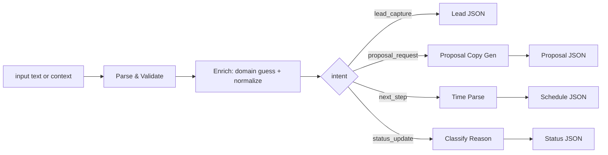

# WhatsApp Revenue Copilot — Unified Assignment (n8n × LangGraph)

> **Goal:** Build a single WhatsApp copilot that (1) **answers questions grounded in Google Drive docs** and (2) **captures + advances sales leads** to proposals & follow-ups — using **two separate LangGraph agents** coordinated by **n8n**.
> **Important:** Users do **not** type `/commands`. The system **auto-detects intent** (Q\&A, upload, lead capture, proposal, scheduling, status) from natural language and attachments.

---

## 1) High-Level Overview

* **Agent A — Knowledge Agent (LangGraph, Python):**
  Ingests files from Drive, chunks + embeds, retrieves & answers grounded questions with citations, and extracts follow-up scheduling intents (natural language → ISO time).

* **Agent B — Dealflow Agent (LangGraph, Python):**
  Parses free-text lead info, validates/enriches (e.g., company domain guess), generates proposal copy, classifies status reason, and extracts next-step scheduling intents.

* **n8n (orchestrator + integrations):**
  WhatsApp webhook, Google Drive/Sheets/Calendar actions, Drive watch, nightly re-index, error channel, retries.
  **Rule:** Agents never call Google/WhatsApp directly — **n8n** performs side-effects.

---

## 2) Natural-Language Workflow (No Slash Commands)

### 2.1 Incoming WhatsApp Message Routing (n8n)

1. **Trigger:** WhatsApp inbound (text and/or attachments).
2. **Fast intent pre-routing (n8n):**

   * If **attachments present** → route to **Agent A** (`/agentA/ingest`) and store files under `Drive:/KnowledgeBase/**`.
   * Else **text-only** → send to a **lightweight Intent Classifier** (can be part of Agent B or a shared mini-graph) returning:

     * `intent: "knowledge_qa" | "lead_capture" | "proposal_request" | "next_step" | "status_update" | "smalltalk" | "unknown"`
     * `entities` (names, orgs, date/time, budget, etc., if present)
   * n8n then calls the proper agent endpoint with the normalized payload.

> **Note:** You can implement the **Intent Classifier** as a small LangGraph with a system prompt and a JSON schema output (pydantic) or as a node inside each agent (duplicate logic) — **preferred: shared mini-graph** to keep both agents clean.

---

### 2.2 Knowledge Flows (Agent A + n8n)

#### A) **File ingestion (implicit when user sends a file)**

* **User:** *\[sends PDF/Doc]*
* **n8n:** Save to `Drive:/KnowledgeBase/**`, call `POST /agentA/ingest {driveFileId}`.
* **Agent A:** Chunk → embed → persist to vector store → return `{chunks, tokens}`.
* **n8n:** Confirm to user: “Got it — I’ve added **<filename>** to the knowledge base.”

#### B) **Grounded Q\&A (no /ask)**

* **User:** “What’s our refund policy?”
* **n8n:** Classify → `intent = knowledge_qa` → call `POST /agentA/ask { userId, text }`.
* **Agent A:** Retrieve → Answer (with citations) → *(optional)* Self-reflection to reduce hallucination → return `{answer, citations[], confidence}`.
* **n8n:**

  * Send answer with **citations** back on WhatsApp.
  * Append **Conversations Sheet** row: timestamp, user, intent, input, output, confidence, source links.

#### C) **Follow-up scheduling embedded in user text**

* **User:** “Let’s set a call next Tue at 10:00 with Dana about refunds.”
* **n8n:** Classify → `intent = next_step` but **context = knowledge topic** → call `POST /agentA/followup-parse { text }`.
* **Agent A:** Parse title + time → `{title, startISO, endISO?}`.
* **n8n:** Create Calendar event → confirm on WhatsApp → log in **Conversations Sheet**.

---

### 2.3 Dealflow Flows (Agent B + n8n)

#### D) **Lead capture (no /newlead)**

* **User:** “John from Acme wants a PoC in September, budget around 10k.”
* **n8n:** Classify → `intent = lead_capture` → call `POST /agentB/newlead { raw }`.
* **Agent B:** Parse & normalize (name/company/intent/budget), light enrichment (domain guess), return typed JSON.
* **n8n:** Upsert **CRM Sheet** row; reply with normalized summary & a link to row.

#### E) **Proposal generation (no /proposal)**

* **User:** “Can you draft a proposal for Acme?” *(or inferred from the last captured lead)*
* **n8n:** Classify → `intent = proposal_request` → call `POST /agentB/proposal-copy { lead }`.
* **Agent B:** Generate title, summary blurb, bullets (tone-controlled).
* **n8n:** Copy Drive **Doc template**, merge fields, export PDF → share link back → update CRM **Links** column.

#### F) **Next step scheduling (no /nextstep)**

* **User:** “Schedule a demo next Wed at 11.”
* **n8n:** Classify → `intent = next_step` with **dealflow context** → call `POST /agentB/nextstep-parse { text }`.
* **Agent B:** Return `{title, startISO, endISO?}`.
* **n8n:** Create Calendar event → confirm → update **CRM Sheet** `NextStepDate`.

#### G) **Status update (no /status)**

* **User:** “We lost the Acme deal — budget cut.”
* **n8n:** Classify → `intent = status_update`.
* **n8n:** Call `POST /agentB/status-classify { label:"Lost", reasonText:"budget cut" }`.
* **Agent B:** Return `{label, reasonCategory, reasonSummary}`.
* **n8n:** Update **CRM Sheet** `Stage` & `Notes`; confirm on WhatsApp.

---

## 3) Must-Have Technology

* **LangGraph (Python) + LangChain**

  * Agent A nodes: **Ingest → Embed → Retrieve → Answer → (Self-Reflect) → LogIntent → ScheduleIntent**
  * Agent B nodes: **Parse → Validate/Enrich → ProposalCopy → StatusClassify → LogIntent → ScheduleIntent**
  * Vector DB: **Chroma** (acceptable) with disk persistence.
  * Text splitters + embeddings (OpenAI or local).

* **n8n**

  * WhatsApp inbound/outbound, Drive (watch/upload/download/template copy/export), Sheets (append/update), Calendar (create).
  * Nightly re-index job; stale lead pings; **error channel** with retries & alerts.

* **Google APIs**

  * Drive, Sheets, Calendar with least-privilege scopes.

---

## 4) Data & Artifacts

* **Drive**

  * `KnowledgeBase/**` (ingested docs)
  * `Proposals/**` (templates + generated PDFs)

* **Sheets**

  * `Conversations`: `Timestamp, User, Intent, Input, Output, Confidence, Citations/Links, Error?`
  * `CRM`: `Timestamp, LeadId, Name, Company, Intent, Budget, Stage, Owner, NextStepDate, Links(Proposal, DriveFolder), Notes`

* **Calendar**

  * Events include contextual description + links (Drive/Sheet row).

* **Vector Store**

  * Chroma persistent volume (e.g., `./data/chroma/`).

---

## 5) API Contracts (Agents)

### Agent A (Knowledge)

* `POST /agentA/ingest` → `{ driveFileId }` ⇒ `{ chunks, tokens }`
* `POST /agentA/ask` → `{ userId, text }` ⇒ `{ answer, citations:[{title, driveFileId, pageRanges?}], confidence:number }`
* `POST /agentA/followup-parse` → `{ text }` ⇒ `{ title, startISO, endISO?, attendees?:string[] }`

### Agent B (Dealflow)

* `POST /agentB/newlead` → `{ raw }` ⇒ `{ name, company, intent, budget, normalizedCompanyDomain?, qualityScore?, notes? }`
* `POST /agentB/proposal-copy` → `{ lead:{...} }` ⇒ `{ title, summaryBlurb, bulletPoints:string[] }`
* `POST /agentB/nextstep-parse` → `{ text }` ⇒ `{ title, startISO, endISO? }`
* `POST /agentB/status-classify` → `{ label:"Won"|"Lost"|"On hold", reasonText? }` ⇒ `{ label, reasonCategory, reasonSummary }`

> **All endpoints:** return **typed JSON**, include a `requestId` for observability.

---

## 6) System Diagrams

### 6.1 End-to-End Sequence (Mermaid)



### 6.2 Agent A Node Map (Mermaid)



### 6.3 Agent B Node Map (Mermaid)



---

## 7) Engineering & DevEx Requirements

* **Reliability & Errors:**

  * n8n retries with exponential backoff on Google 5xx, WhatsApp send failures.
  * Idempotency keys for Sheets/Calendar writes (avoid duplicates on retries).
  * OAuth refresh handling; error channel workflow in n8n.

* **Security:**

  * Secrets via env; least-privilege Google scopes; **no secrets in repo**.
  * Basic input sanitization (strip HTML, limit file types/size).

* **Observability:**

  * `requestId` per message, structured logs in agents, n8n error path.
  * Minimal metrics: ingested files, Q\&A latency, retrieval hit rate, lead funnel counts.

* **Testability:**

  * Unit tests for LangGraph tools (mock LLM & Google I/O).
  * Golden tests for intent classification & entity extraction.

* **Delivery:**

  * **One-command bootstrap**: `docker compose up` (services: n8n, agentA, agentB, chroma).
  * `README.md`: setup steps (Google project/scopes), WhatsApp webhook, n8n import, examples.
  * Commit n8n workflow JSON and FastAPI apps; Python type hints + linting.

---

## 8) Demo Script (What exactly to show)

1. **User sends “What’s our refund policy?”**

   * Bot replies with grounded answer + 2–3 citations.

2. **User sends a new PDF (Refunds\_2025.pdf).**

   * Bot confirms file was added.

3. **User asks again “And what about digital goods refunds?”**

   * Bot answers using the **new document** (cite it explicitly).

4. **User texts “Schedule a call next Tue 10:00 with Dana about refunds.”**

   * Bot creates Calendar event, replies with confirmation + link.

5. **User texts “John from Acme wants a PoC in September, budget \~10k.”**

   * Bot captures lead, shares CRM row link.

6. **User texts “Draft a proposal for Acme.”**

   * Bot returns Drive PDF link to generated proposal.

7. **User texts “Let’s set a demo next Wed at 11.”**

   * Bot creates Calendar event and updates `NextStepDate` in CRM.

8. **User texts “We lost Acme — budget cut.”**

   * Bot updates status = Lost; logs reason (categorized).

Finally, show **Sheets** (Conversations + CRM), **Drive** (KnowledgeBase + Proposals), and **Calendar** entries.

---

## 9) Scoring (100 pts)

* Functionality & correctness: **40**
* Architecture & code quality: **25**
* Reliability (errors, retries, idempotency): **15**
* Security & configuration hygiene: **10**
* Docs & demo clarity: **10**

---

## 10) Suggested Repo Layout

```
/agents
  /agentA_knowledge
    app.py
    graph.py
    tools.py
    tests/
  /agentB_dealflow
    app.py
    graph.py
    tools.py
    tests/
/n8n
  workflows/
    whatsapp_router.json
    drive_watch.json
    nightly_reindex.json
    error_channel.json
/data/chroma/           # persisted vector store
/infra
  docker-compose.yml
  env.sample
/docs
  README.md
  sequence-diagram.mmd
  agentA-graph.png
  agentB-graph.png
```

---

## 11) Concrete Acceptance Criteria

* ✅ Works end-to-end from WhatsApp with **no slash commands**.
* ✅ Two agents (A/B) built with LangGraph; both used in the demo.
* ✅ n8n performs all side-effects (Drive/Sheets/Calendar/WhatsApp).
* ✅ Vector store persists across restarts.
* ✅ Conversations & CRM Sheets updated correctly.
* ✅ Calendar events created from natural language.
* ✅ Proposal generated from template + LLM copy.
* ✅ Unit tests cover parsing, retrieval, and proposal generation logic.

---

## 12) Suggestions to Make It Even Better (Optional Enhancements)

* **Shared “Context Memory”**: store last referenced lead or topic so follow-ups like “draft a proposal for them” resolve correctly without repeating names (with time-boxed expiry to avoid confusion).
* **Toolformer-style Self-Reflection** in both agents to reduce hallucinations (especially for RAG answers & proposal tone).
* **Multi-Tenancy**: isolate Sheets/Drive folders per WhatsApp number (or per OrgId) via n8n routing.
* **“Dry-Run” Mode** for Calendar/Sheets in demos (agents still return JSON; n8n logs instead of writing).
* **Voice Notes**: auto-transcribe (Whisper) → run same intent flow.
* **Lead Scoring**: Agent B outputs `qualityScore` and flags missing fields (“no timeline”, “no budget”) to request clarifications.
* **Background Jobs**: nightly re-embeddings + stale lead nudges (e.g., “No touch in 7 days → ping user”).

---

## 13) Example Prompts (for Classifier & Agents)

**Classifier system hint (JSON output required):**

> “Given a WhatsApp message and conversation context, identify intent (knowledge\_qa, lead\_capture, proposal\_request, next\_step, status\_update, smalltalk, unknown) and extract entities (names, orgs, datetime, budget). Return only JSON conforming to schema.”

**Agent A answer policy:**

> “Answer concisely and cite **exact file names** (and page/section when available). If confidence < 0.6, say what’s missing and suggest adding or re-phrasing.”

**Agent B proposal policy:**

> “Generate a one-page proposal blurb aligned with the lead’s intent and timeline. Keep business tone, 120–160 words plus 3–5 bullets. Avoid commitments you cannot back with sources.”
